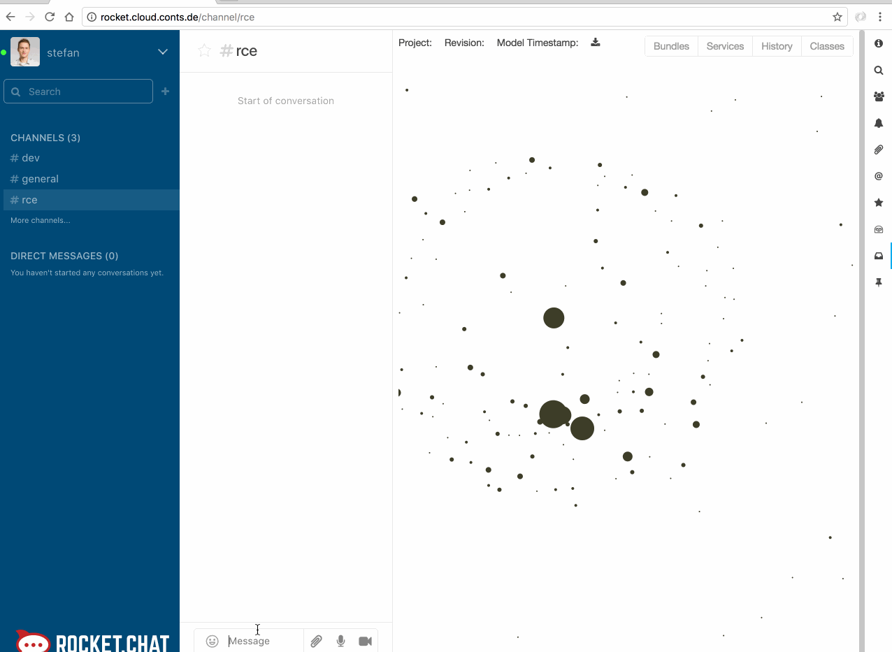

# Sofia 

The Sofia project ( **So**ftware "**F**ramework" for **I**nteraction with Software **A**rchitecture) emerged during my bachelor thesis. It is a prototype implementation of a microservice architecture for chat bot interaction with source code visualizations.



## Requirements 

* Docker >= 1.12.3 
* Docker-Compose  >= 1.8

## Getting started 

```sh

$ docker-compose .

```

## Services 

The project consists of multiple services.  

|  Service | production | develop | License |  
|---|---|---|---|
|  [Question service](./service-question) | []( https://g.codefresh.io/repositories/B-Stefan/Sofia/builds?filter=trigger:build;branch:master;service:587db587c07e7d01005a9911~service-question)  | []( https://g.codefresh.io/repositories/B-Stefan/Sofia/builds?filter=trigger:build;branch:dev;service:587db587c07e7d01005a9911~service-question) |   |
|  [Hubot service ](./service-hubot) |  []( https://g.codefresh.io/repositories/B-Stefan/Sofia/builds?filter=trigger:build;branch:master;service:587e5febc07e7d01005bf971~service-hubot) | []( https://g.codefresh.io/repositories/B-Stefan/Sofia/builds?filter=trigger:build;branch:dev;service:587e5febc07e7d01005bf971~service-hubot) |   |   
|  [RocketChat service ](./service-rocket-chat) |  []( https://g.codefresh.io/repositories/B-Stefan/Sofia/builds?filter=trigger:build;branch:master;service:58a35235c337c70100419ddb~service-rocket-chat)| []( https://g.codefresh.io/repositories/B-Stefan/Sofia/builds?filter=trigger:build;branch:dev;service:58a35235c337c70100419ddb~service-rocket-chat) |   |   
|  [OSGi visualization UI service ](./service-osgi-visualization-ui) |  []( https://g.codefresh.io/repositories/B-Stefan/Sofia/builds?filter=trigger:build;branch:master;service:5879f74d1148080100b67d71~service-osgi-visualization-ui) | []( https://g.codefresh.io/repositories/B-Stefan/Sofia/builds?filter=trigger:build;branch:dev;service:5879f74d1148080100b67d71~service-osgi-visualization-ui) |   |   
   